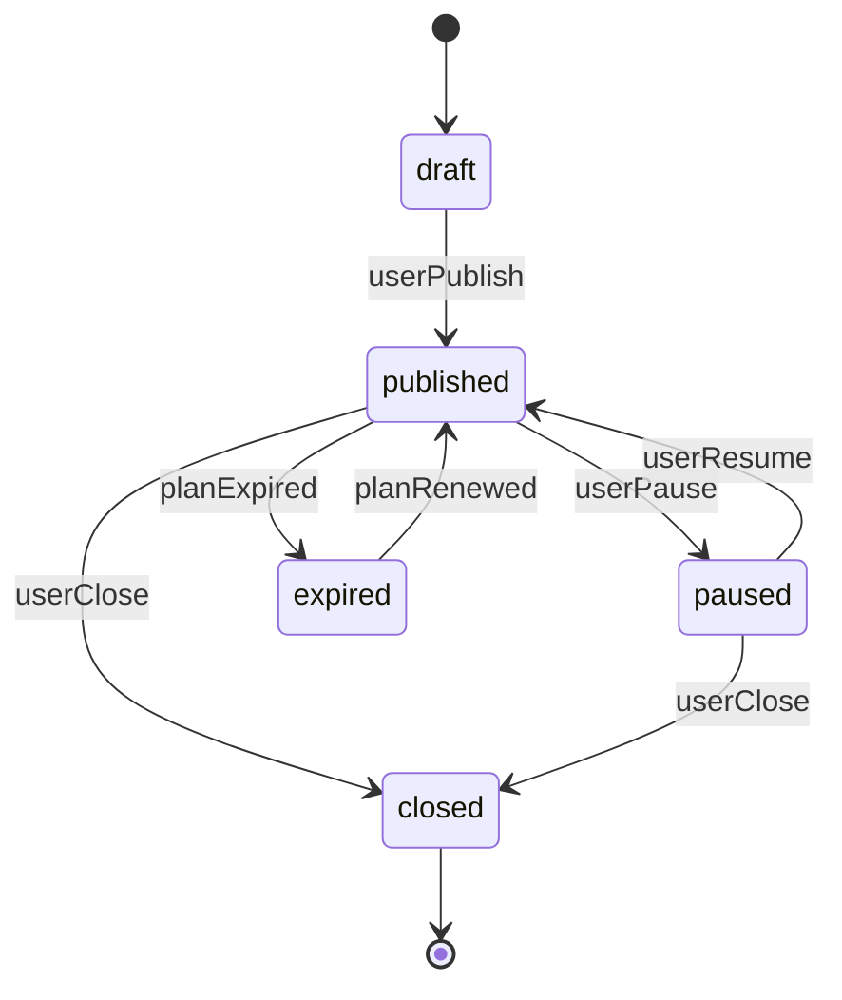

# Publications Domain Module

**Módulo de dominio puro para el sistema de publicaciones de Avanzza 2.0**

---

## 📋 Tabla de Contenidos

- [Visión General](#visión-general)
- [Arquitectura](#arquitectura)
- [Entidades y Value Objects](#entidades-y-value-objects)
- [Payloads Polimórficos](#payloads-polimórficos)
- [Ciclo de Vida](#ciclo-de-vida)
- [Planes de Monetización](#planes-de-monetización)
- [Sistema de Scoring](#sistema-de-scoring)
- [Uso y Ejemplos](#uso-y-ejemplos)

---

## 🎯 Visión General

El módulo **Publications** implementa un sistema de publicaciones con:

- **5 tipos de publicaciones** mediante discriminated union
- **Monetización basada en créditos** con 4 planes (FREE_ONCE, STARTER, PLUS, PRO)
- **Sistema de scoring** para ranking y descubrimiento
- **Ciclo de vida robusto** con validación de transiciones
- **Offline-first** compatible con Isar + Firestore
- **Dominio puro** (solo `dart:core`)

---

## 🏗️ Arquitectura

### Capas del Sistema

```
┌─────────────────────────────────────────────────────────────┐
│                     PRESENTATION LAYER                       │
│  (UI components, GetX controllers, bindings - NO INCLUIDO)  │
└─────────────────────────────────────────────────────────────┘
                              │
                              ▼
┌─────────────────────────────────────────────────────────────┐
│                        DATA LAYER                            │
│   (Isar models, Firestore models, repositories - FUTURO)    │
└─────────────────────────────────────────────────────────────┘
                              │
                              ▼
┌─────────────────────────────────────────────────────────────┐
│                       DOMAIN LAYER ★                         │
│  ┌────────────────────────────────────────────────────────┐ │
│  │ shared/ (VOs, Enums, Results compartidos)             │ │
│  ├────────────────────────────────────────────────────────┤ │
│  │ publications/                                          │ │
│  │  ├─ entities/                                          │ │
│  │  │   ├─ publication.dart (Entidad Agregada)           │ │
│  │  │   └─ payloads/ (5 payloads polimórficos)           │ │
│  │  ├─ value_objects/                                     │ │
│  │  │   ├─ publication_plan.dart                          │ │
│  │  │   ├─ publication_audience.dart                      │ │
│  │  │   └─ publication_tag.dart                           │ │
│  │  ├─ services/                                          │ │
│  │  │   └─ publication_lifecycle_policy.dart              │ │
│  │  └─ errors/                                            │ │
│  │      └─ publication_plan_exceptions.dart               │ │
│  └────────────────────────────────────────────────────────┘ │
└─────────────────────────────────────────────────────────────┘
```

---

## 📦 Entidades y Value Objects

### Entidad Principal: `Publication`

```dart
class Publication {
  final String id;
  final String ownerId;
  final int createdAtEpochMs;
  final int updatedAtEpochMs;
  final String? countryCode;  // ISO 3166-1 alpha-2
  final String? city;
  final String status;         // draft | published | archived
  final String kind;           // driver_seek | tenant_seek | ...
  final Object payload;        // Polimórfico según kind
}
```

**Discriminated Union por `kind`:**

| Kind Wire Name        | Payload Type                  | Descripción                    |
|-----------------------|-------------------------------|--------------------------------|
| `driver_seek`         | `DriverSeekPayload`           | Conductor busca vehículo       |
| `tenant_seek`         | `TenantSeekPayload`           | Inquilino busca inmueble       |
| `product_offer`       | `ProductOfferPayload`         | Proveedor ofrece productos     |
| `service_offer`       | `ServiceOfferPayload`         | Proveedor ofrece servicios     |
| `branch_announcement` | `BranchAnnouncementPayload`   | Proveedor anuncia sucursal     |

---

### Value Objects Principales

#### 1. **PublicationPlan**

Enum con 4 planes de monetización:

```dart
enum PublicationPlan {
  freeOnce,    // Lifetime, 1 publicación, 0 créditos
  starter,     // 30 días, 1 boost, 5 créditos
  plus,        // 60 días, 3 boosts, 15 créditos
  pro,         // 90 días, 5 boosts, 30 créditos
}
```

**Metadata por Plan:**

| Plan       | Duración | Créditos | Boosts | Peso Discovery | Max Renovaciones |
|------------|----------|----------|--------|----------------|------------------|
| FREE_ONCE  | Lifetime | 0        | 0      | 1.0            | 0                |
| STARTER    | 30 días  | 5        | 1      | 1.2            | 3                |
| PLUS       | 60 días  | 15       | 3      | 1.5            | 5                |
| PRO        | 90 días  | 30       | 5      | 2.0            | Ilimitado        |

#### 2. **PublicationAudience**

Sistema de scoring geográfico:

```dart
class PublicationAudience {
  final AudienceScope scope;     // city | region | multiRegion | national
  final String? cityId;
  final List<String> regionIds;
  final String countryId;
  final GeoCoord? location;      // Lat/Lon para distancia
}
```

**Scoring Components:**

- **Geo Score** (40%): Haversine distance-based
- **Plan Score** (25%): Normalizado por plan tier
- **Freshness Score** (20%): Decay exponencial (λ=0.1)
- **Boost Score** (15%): Boost activo vs total disponible

#### 3. **PublicationTag**

Normalización y fuzzy matching:

```dart
class PublicationTag {
  final String raw;         // "Neumáticos Nuevos"
  final String normalized;  // "neumaticos nuevos"
}
```

**Tag Matching:**
- Exact match: score = 1.0
- Fuzzy match (≥3 chars): score = 0.5
- Max 10 tags por publicación

---

## 🔄 Payloads Polimórficos

### 1. DriverSeekPayload

**Conductor buscando vehículo**

```dart
DriverSeekPayload(
  vehicleCategory: 'auto',           // VehicleCategory enum
  employmentMode: 'empleado',        // EmploymentMode enum
  preferredCities: ['Bogotá'],       // CityList VO (max 30)
  experienceYearsMin: 3,
  hasLicense: true,
  licenseType: 'B1',
  immediateAvailability: true,
)
```

**Enums:**
- `VehicleCategory`: auto, camion, moto, autobus, maquinariaPesada, otro
- `EmploymentMode`: empleado, contratista, flexible, otro

---

### 2. TenantSeekPayload

**Inquilino buscando inmueble**

```dart
TenantSeekPayload(
  propertyType: 'apartamento',       // PropertyType enum
  budgetMin: 1000000,                // MoneyRange VO
  budgetMax: 2000000,
  currencyCode: 'COP',               // CurrencyCode VO (ISO 4217)
  preferredCities: ['Medellín'],     // CityList VO
  bedroomsMin: 2,
  parkingRequired: true,
  leaseDuration: 'largo_plazo',      // LeaseDuration enum
)
```

**Enums:**
- `PropertyType`: apartamento, casa, local, bodega, oficina, otro
- `LeaseDuration`: cortoPlazo, largoPlazo, flexible, otro

---

### 3. ProductOfferPayload

**Proveedor ofreciendo productos**

```dart
ProductOfferPayload(
  productCategory: 'repuestos',      // ProductCategory enum
  productName: 'Filtro de Aceite',
  condition: 'nuevo',                // ProductCondition enum
  unitPrice: 50000,                  // centavos
  currencyCode: 'COP',
  stockQuantity: 100,
  coverageAreas: ['Bogotá', 'Cali'], // CoverageAreaList VO (max 50)
  warrantyMonths: 12,
  brand: 'Bosch',
)
```

**Enums:**
- `ProductCategory`: repuestos, neumaticos, herramientas, lubricantes, accesorios, materiales, maquinaria, otro
- `ProductCondition`: nuevo, usado, reacondicionado, otro

---

### 4. ServiceOfferPayload

**Proveedor ofreciendo servicios**

```dart
ServiceOfferPayload(
  serviceCategory: 'mecanica',       // ServiceCategory enum
  serviceName: 'Cambio de Aceite',
  basePrice: 80000,                  // opcional (cotizable)
  currencyCode: 'COP',               // requerido si basePrice > 0
  coverageAreas: ['Bogotá Norte'],
  onSite: true,                      // servicio en sede
  mobileService: true,               // servicio a domicilio
  slaHours: 24,                      // SLA de respuesta
  warrantyDays: 30,
)
```

**Enums:**
- `ServiceCategory`: mecanica, electrica, latoneriaPintura, diagnostico, alineacionBalanceo, llantas, lubricacion, otro

---

### 5. BranchAnnouncementPayload

**Proveedor anunciando nueva sucursal**

```dart
BranchAnnouncementPayload(
  branchName: 'Taller Central',
  address: 'Calle 100 #15-20',
  city: 'Bogotá',
  coverageAreas: ['Usaquén', 'Chapinero'],
  openingDateEpochMs: 1700000000000,
  phone: '+573001234567',
  email: 'info@taller.com',
  mapsUrl: 'https://maps.google.com/...',
  servicesOffered: ['Mecánica', 'Latonería'], // max 50, ≤80 chars
)
```

---

## 🔄 Ciclo de Vida

### Estados (PublicationStatus)



**Transiciones Válidas:**

| Estado    | Puede transitar a                | Razones Válidas                                    |
|-----------|----------------------------------|---------------------------------------------------|
| draft     | published                        | userPublish                                       |
| published | paused, expired, closed          | userPause, planExpired, userClose                 |
| paused    | published, closed                | userResume, userClose                             |
| expired   | published                        | planRenewed                                       |
| closed    | _(final)_                        | -                                                 |

**Validación:**

```dart
PublicationLifecyclePolicy.transition(
  from: PublicationStatus.published,
  to: PublicationStatus.paused,
  reason: PublicationTransitionReason.userPause,
  nowUtc: DateTime.now().toUtc(),
  requestId: 'req-123',
);
// → LifecycleResult.success(...)
```

---

## 💰 Planes de Monetización

### Activación de Plan

```dart
final result = PublicationPlanService.activate(
  plan: PublicationPlan.starter,
  userId: 'user-123',
  publicationId: 'pub-456',
  nowUtc: DateTime.now().toUtc(),
  requestId: 'req-789',
  planPolicy: MyPlanPolicy(), // implementa PublicationPlanPolicy
);

if (result is PlanOperationSuccess) {
  print('Plan activado. Créditos debitados: ${result.creditsDebited}');
  print('Expira: ${result.expiresAt}');
}
```

### Renovación de Plan

```dart
final result = PublicationPlanService.renew(
  currentPlan: PublicationPlan.starter,
  renewalCount: 1,
  userId: 'user-123',
  publicationId: 'pub-456',
  nowUtc: DateTime.now().toUtc(),
  requestId: 'req-790',
  planPolicy: MyPlanPolicy(),
);

if (result is PlanRenewalLimitExceeded) {
  print('Límite de renovaciones alcanzado: ${result.currentCount}/${result.maxAllowed}');
}
```

### Política de Transacciones

Implementar `PublicationPlanPolicy`:

```dart
class MyPlanPolicy implements PublicationPlanPolicy {
  @override
  Future<bool> debitCredits(String userId, int amount, String requestId) async {
    // Implementar débito atómico con idempotencia
    // Retornar true si éxito, false si créditos insuficientes
  }

  @override
  Future<bool> isRequestProcessed(String requestId) async {
    // Verificar si requestId ya fue procesado (deduplicación)
  }
}
```

---

## 📊 Sistema de Scoring

### Cálculo de Score Total

```dart
final totalScore = PublicationAudienceService.computeTotalScore(
  userLat: 4.6097,
  userLon: -74.0817,
  pubLat: 4.7110,
  pubLon: -74.0721,
  planDiscoveryWeight: 1.5,         // PublicationPlan.plus
  publishedAtEpochMs: 1700000000000,
  nowEpochMs: 1700100000000,
  boostsUsed: 1,
  boostsTotal: 3,
);

print('Total Score: ${totalScore.total}');  // 0.0 - 1.0
print('  Geo: ${totalScore.geo}');          // 40%
print('  Plan: ${totalScore.plan}');        // 25%
print('  Freshness: ${totalScore.freshness}'); // 20%
print('  Boost: ${totalScore.boost}');      // 15%
```

### Componentes Individuales

**1. Geo Score (Haversine):**

```dart
final geoScore = PublicationAudienceService.computeGeoScore(
  userLat: 4.6097,
  userLon: -74.0817,
  pubLat: 4.7110,
  pubLon: -74.0721,
  maxDistanceKm: 50.0,
);
// → 1.0 (distancia 0km) decae linealmente hasta 0.0 (≥ 50km)
```

**2. Plan Score:**

```dart
final planScore = PublicationAudienceService.computePlanScore(
  planDiscoveryWeight: 2.0, // PRO
);
// → 1.0 (normalizado: (2.0 - 1.0) / (2.0 - 1.0) * 0.75 + 0.25)
```

**3. Freshness Score (Exponential Decay):**

```dart
final freshnessScore = PublicationAudienceService.computeFreshnessScore(
  publishedAtEpochMs: 1700000000000,
  nowEpochMs: 1700086400000, // +24h
  lambda: 0.1, // decay rate
);
// → exp(-0.1 * 1) ≈ 0.9048
```

**4. Boost Score:**

```dart
final boostScore = PublicationAudienceService.computeBoostScore(
  boostsUsed: 2,
  boostsTotal: 5,
);
// → 0.4 (2/5)
```

---

## 🔍 Tag Matching

### Normalización y Búsqueda

```dart
// Crear tags normalizados
final tag1 = PublicationTag(raw: 'Neumáticos Nuevos');
print(tag1.normalized); // "neumaticos nuevos"

// Tag set con límite
final tagSet = PublicationTagSet.create([
  'repuestos',
  'filtros',
  'aceite',
  // ... max 10 tags
]);

// Fuzzy matching
final matchResult = PublicationTagService.matchTags(
  queryTags: ['neumaticos', 'michelin'],
  publicationTags: ['neumaticos nuevos', 'goodyear'],
  minLengthFuzzy: 3,
);

print('Exact matches: ${matchResult.exactMatches}');   // ['neumaticos']
print('Fuzzy matches: ${matchResult.fuzzyMatches}');   // []
print('Total score: ${matchResult.score}');            // 1.0 (1 exact)
```

---

## 💻 Uso y Ejemplos

### Crear Publicación

```dart
import 'package:avanzza/domain/shared/shared.dart';
import 'package:avanzza/domain/publications/entities/publication.dart';
import 'package:avanzza/domain/publications/entities/payloads/driver_seek_payload.dart';

// 1. Crear payload
final payload = DriverSeekPayload.create(
  vehicleCategory: 'auto',
  preferredCities: ['Bogotá', 'Medellín'],
  experienceYearsMin: 2,
  hasLicense: true,
);

// 2. Crear publicación
final result = Publication.tryCreate(
  id: 'pub-001',
  ownerId: 'user-123',
  createdAtEpochMs: DateTime.now().millisecondsSinceEpoch,
  updatedAtEpochMs: DateTime.now().millisecondsSinceEpoch,
  countryCode: 'CO',
  city: 'Bogotá',
  status: 'draft',
  kind: 'driver_seek',
  payload: payload,
);

if (result.isSuccess) {
  final publication = result.value;
  print('Publicación creada: ${publication.id}');

  // Type-safe access
  final driverPayload = publication.asDriverSeek;
  print('Ciudades: ${driverPayload.preferredCities}');
}
```

### JSON Roundtrip

```dart
// Serializar
final json = publication.toJson();

// Deserializar
final restored = Publication.fromJson(json);

// Validar igualdad semántica
assert(publication == restored);
```

### Validación con Acumulación de Errores

```dart
final result = Publication.tryCreate(
  id: '',  // ❌ vacío
  ownerId: 'a' * 121,  // ❌ > 120 chars
  createdAtEpochMs: -1,  // ❌ negativo
  updatedAtEpochMs: 0,  // ❌ < createdAt
  countryCode: 'COL',  // ❌ no ISO 3166-1
  status: 'published',
  kind: 'driver_seek',
  payload: payload,
);

if (result.isFailure) {
  for (final error in result.errors) {
    print('${error.field}: ${error.message}');
  }
  // id: No puede estar vacío
  // ownerId: No puede exceder 120 caracteres
  // createdAtEpochMs: No puede ser negativo
  // updatedAtEpochMs: No puede ser menor que createdAtEpochMs
  // countryCode: Debe ser ISO 3166-1 alpha-2 (2 letras mayúsculas)
}
```

---

## 📐 Diagramas de Arquitectura

### Diagrama de Componentes

```
┌───────────────────────────────────────────────────────────────────┐
│                       Publication (Aggregate Root)                 │
│  ┌─────────────────────────────────────────────────────────────┐  │
│  │ id, ownerId, status, kind, payload                          │  │
│  │ createdAt, updatedAt, countryCode, city                     │  │
│  └─────────────────────────────────────────────────────────────┘  │
│                              │                                     │
│              ┌───────────────┼───────────────┐                     │
│              ▼               ▼               ▼                     │
│   ┌─────────────────┐ ┌────────────┐ ┌─────────────────┐          │
│   │DriverSeekPayload│ │TenantSeek..│ │ProductOffer...  │          │
│   └─────────────────┘ └────────────┘ └─────────────────┘          │
│              ▼               ▼                                     │
│   ┌─────────────────┐ ┌─────────────────┐                         │
│   │ServiceOffer...  │ │BranchAnnounce...│                         │
│   └─────────────────┘ └─────────────────┘                         │
└───────────────────────────────────────────────────────────────────┘
                              │
                              ▼
┌───────────────────────────────────────────────────────────────────┐
│                    Shared Domain (domain/shared/)                  │
│  ┌────────────────────┬──────────────────────┬─────────────────┐  │
│  │ Value Objects      │ Enums                │ Results         │  │
│  │ • CityList         │ • VehicleCategory    │ • CreationResult│  │
│  │ • CoverageAreaList │ • EmploymentMode     │ • ValidationErr │  │
│  │ • CurrencyCode     │ • PropertyType       │                 │  │
│  │ • MoneyRange       │ • LeaseDuration      │                 │  │
│  │ • AreaRange        │ • ProductCategory    │                 │  │
│  │ • ExperienceRange  │ • ProductCondition   │                 │  │
│  │                    │ • ServiceCategory    │                 │  │
│  └────────────────────┴──────────────────────┴─────────────────┘  │
└───────────────────────────────────────────────────────────────────┘
```

### Diagrama de Flujo: Activación de Plan

```
Usuario solicita activar plan STARTER
           │
           ▼
┌────────────────────────────────┐
│ PublicationPlanService.activate│
└────────────────────────────────┘
           │
           ├─► 1. Validar plan enum
           │
           ├─► 2. Calcular expiración (nowUtc + 30 días)
           │
           ├─► 3. Verificar idempotencia (requestId)
           │      │
           │      ├─ Ya procesado? → Return cached result
           │      └─ No procesado? → Continuar
           │
           ├─► 4. Débito de créditos (5 créditos)
           │      │
           │      ├─ Insuficientes? → InsufficientCredits
           │      └─ OK? → Continuar
           │
           ├─► 5. Registrar transacción
           │
           └─► 6. Return PlanOperationSuccess
                  ├─ creditsDebited: 5
                  ├─ expiresAt: nowUtc + 30d
                  ├─ boostsIncluded: 1
                  └─ renewalsRemaining: 3
```

---

## 🧪 Testing

### Unit Tests

```dart
test('Publication creation validates kind-payload consistency', () {
  final driverPayload = DriverSeekPayload.create(
    vehicleCategory: 'auto',
    preferredCities: ['Bogotá'],
  );

  // ✅ Kind correcto
  final validResult = Publication.tryCreate(
    id: 'pub-001',
    ownerId: 'user-123',
    createdAtEpochMs: 1000,
    updatedAtEpochMs: 1000,
    status: 'draft',
    kind: 'driver_seek',
    payload: driverPayload,
  );
  expect(validResult.isSuccess, isTrue);

  // ❌ Kind incorrecto
  final invalidResult = Publication.tryCreate(
    id: 'pub-002',
    ownerId: 'user-123',
    createdAtEpochMs: 1000,
    updatedAtEpochMs: 1000,
    status: 'draft',
    kind: 'tenant_seek',  // Mismatch!
    payload: driverPayload,
  );
  expect(invalidResult.isFailure, isTrue);
  expect(
    invalidResult.errors.any((e) => e.field == 'payload'),
    isTrue,
  );
});
```

---

## 📚 Referencias

- **Clean Architecture:** Robert C. Martin
- **Domain-Driven Design:** Eric Evans
- **Result Pattern:** Railway-Oriented Programming
- **Wire-Stable Serialization:** Protocol Buffers naming conventions
- **Haversine Formula:** Geo-distance calculation
- **ISO 4217:** Currency codes
- **ISO 3166-1:** Country codes

---

## 📝 Notas de Implementación

### Inmutabilidad Garantizada

Todos los objetos de dominio son inmutables:
- Constructores privados `._(...)`
- `List.unmodifiable()` para colecciones
- `final` en todos los campos
- `copyWith()` retorna nuevas instancias

### Validación Fuerte

- Pattern Result para acumulación de errores
- Dual creation: `create()` lanza, `tryCreate()` retorna Result
- Value Objects con invariantes garantizados
- Enums con wire-stable serialization

### Offline-First Ready

- Sin dependencias async
- JSON serialization completa
- Compatible con Isar (local) y Firestore (remote)
- Listo para sync bidireccional

---

**Version:** 1.0.0
**Last Updated:** 2025-01-05
**Maintainer:** Avanzza Development Team
